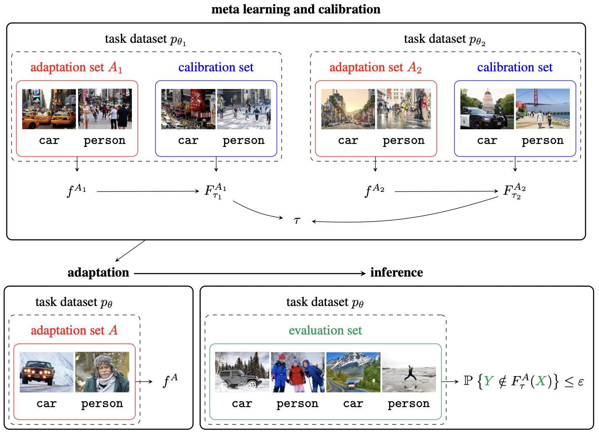

# PAC Prediction Sets for Meta-Learning
This repository is the PyTorch implementation of [PAC Prediction Sets for Meta-Learning](https://arxiv.org/abs/2207.02440) (NeurIPS22).
This code generates a prediction set that satisfies the probably approximately correct (PAC) guarantee for meta learning. 

<p align="center">

## Mini-ImageNet Dataset

Download the Mini-ImageNet dataset from the [original repo](https://github.com/yaoyao-liu/mini-imagenet-tools). 
In particular, download the postprocessed dataset from [this link](https://drive.google.com/open?id=137M9jEv8nw0agovbUiEN_fPl_waJ2jIj), and
put it under `data/miniimagenet`. The following script does this for you along with some postprocessing. 
```
cd data/miniimagenet
./download.sh
```

## FewRel Dataset

## CDC Heart Dataset

Download the Heart dataset as follows:
```
cd data/heart
./download.sh
```

Train a Prototypical network as follows:
```
./scripts/train_heart_protonet.sh
```

Construct a meta PAC prediction set along with baselines as follows:
```
./scripts/cal_heart_protonet.sh
```

